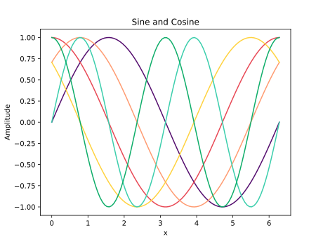

# Aesthema

Aesthema provides modern &amp; visually appealing colormaps for Matplotlib.

Matplotlib is a great package for visualizations, but we've all been there when you start creating your own colormaps because the default ones look not really appealing or you need to stick to your already existing theme.
This is where this small package comes into play. Instead of creating your own colormaps all the time, you can use the provided colormaps or you can also easily create your own colormaps either by using the provided colors or any RGB color.

Currently available colors:


Currently available colormaps:


## Quickstart

You can install the package using `pip`:

```
pip install aesthema
```

Let's take a look at some examples:

```python
import numpy as np
import matplotlib.pyplot as plt

from aesthema import use_colormap


use_colormap()

x = np.linspace(0, 2 * np.pi, 100)

plt.figure()

plt.plot(x, np.sin(x))
plt.plot(x, np.cos(x))
plt.plot(x, np.sin(x + np.pi / 4))
plt.plot(x, np.cos(x + np.pi / 4))
plt.plot(x, np.sin(2 * x))
plt.plot(x, np.cos(2 * x))

plt.title("Sine and Cosine")
plt.xlabel("x")
plt.ylabel("Amplitude")
plt.show()
```



In this example, we use the default colormap. If you want to use a different colormap, just specify it when calling `use_colormap`, e.g.:

```python
from aesthema import use_colormap, Colormaps


use_colormap(Colormaps.PASTEL)
```

You can also create your own custom colormap using either the colors provided in this package or any RGB color:

```python
from aesthema import create_colormap, use_colormap, Colors


my_colormap = create_colormap(
    [
        Colors.RED,
        Colors.ORANGE,
        Colors.LEMON,
        (141, 215, 127),
        Colors.LIGHT_OCEAN,
        (47, 72, 88),
    ]
)
use_colormap(my_colormap)
```

## Contributing

You created a nice colormap that you want to share with others? Awesome! Create a pull request and we will add it.
